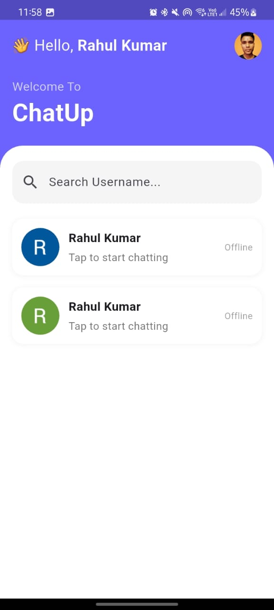
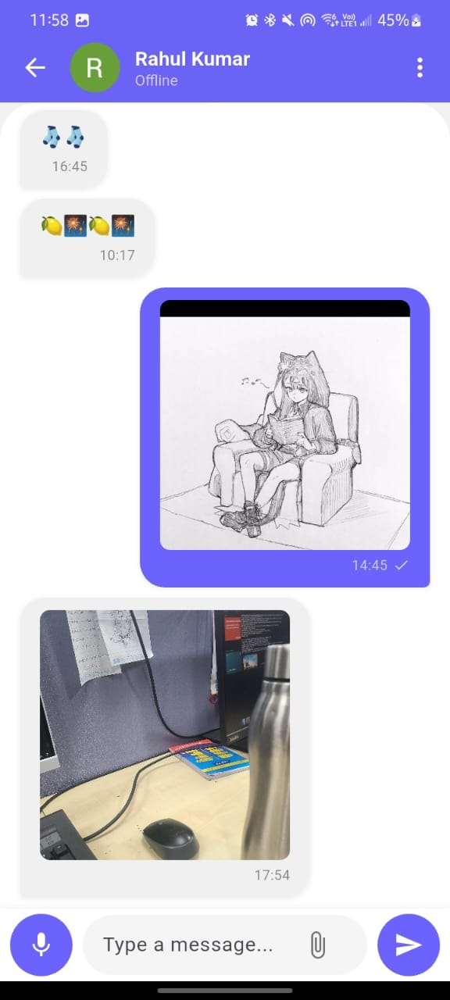

# my

A new Flutter project.

## Getting Started

This project is a starting point for a Flutter application.

A few resources to get you started if this is your first Flutter project:

- [Lab: Write your first Flutter app](https://docs.flutter.dev/get-started/codelab)
- [Cookbook: Useful Flutter samples](https://docs.flutter.dev/cookbook)

For help getting started with Flutter development, view the
[online documentation](https://docs.flutter.dev/), which offers tutorials,
samples, guidance on mobile development, and a full API reference.

## Environment Setup

1. Copy `.env.example` to `.env`
2. Fill in the required environment variables:
   - `GOOGLE_API_KEY`: Your Google API key for services

Never commit the `.env` file or actual API keys to version control.

## Setup Firebase

1. Get `google-services.json` from Firebase Console
2. Place it in `android/app/google-services.json`
3. Never commit this file to version control

//----------------------------------------------------------------------------
 
 
